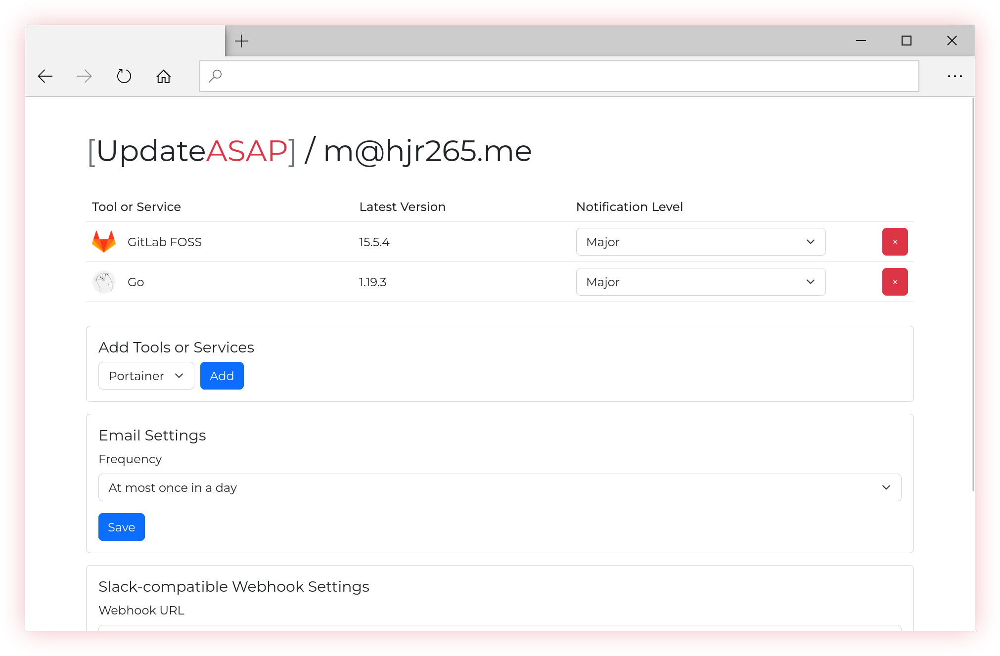

# \[UpdateASAP\]

Get email digests and Slack notifications when your programming tools and self-hosted services get updates.

Log in with your email address (no password, we send you a link). Select programming tools and services you want to keep an eye on for updates. You receive emails and notifications over a Slack-compatible webhook.

## More Tools and Services

Please open issues to request support for new tools and services. PRs are more than welcome.

Check the `registry/` directory for examples.
